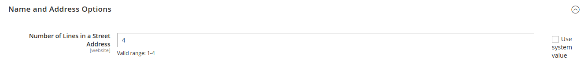
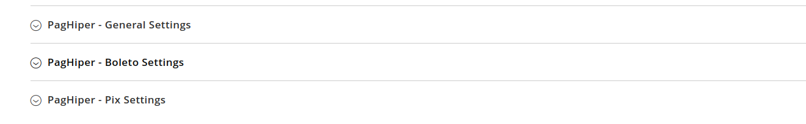
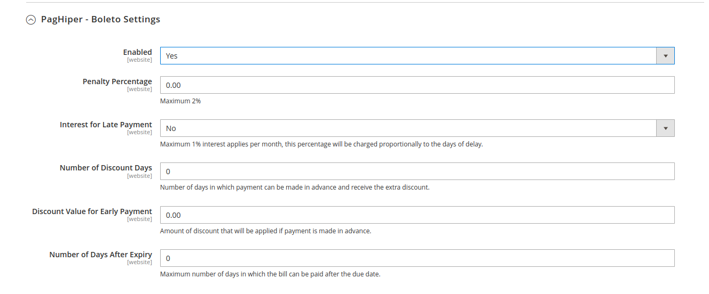
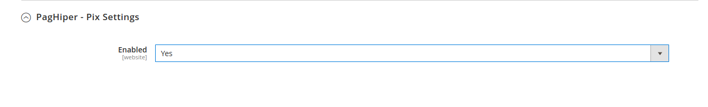
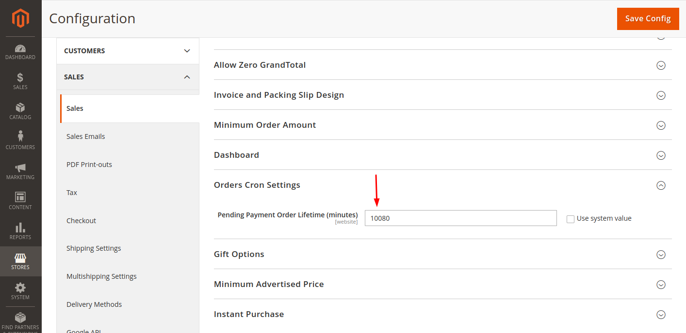

# Integration module [PagHiper](https://www.paghiper.com/) 

## Installation

> We recommend that you have a testing environment to validate changes and updates before upgrading your production store. Also, that a backup is made with all the information before executing any update/installation procedure.

### Compatible Versions:

- [x] 2.3.X
- [x] 2.4.0
- [x] 2.4.1
- [x] 2.4.2 
- [x] 2.4.3
- [x] 2.4.4
- [x] 2.4.5
- [x] 2.4.6
 
### Prerequisite:

- Requires PHP to be at least version 7.0.X.
- The customer's address must consist of at least 3 lines.

### PagHiper Integration Module Installation:

- Download the module and follow the steps below according to how your store was installed:

  #### [Paghiper Module](https://github.com/paghiper/Modulo-PagHiper-Pix-Magento-2.3.X-e-2.4.X)

### Install using Composer

1. Install via Packagist
   - ```composer require paghiper/module-magento2```
       - At this point, you may be asked for your Magento authentication credentials. If you have any questions, there is a description of how to proceed with this. [Adobe Documentation](http://devdocs.magento.com/guides/v2.0/install-gde/prereq/connect-auth.html).
2. Run the commands:
   - ```bin/magento setup:upgrade```
   - ```bin/magento setup:di:compile```
   - ```bin/magento setup:static-content:deploy -f```
   

   ### Install using github

- If your store was created by cloning or downloading the Magento project, follow these steps:

1.Download the repository as a .zip file.
2.Within the installation directory of your store, create the folder structure app/code/Paghiper/Magento2.
3.Extract the contents of the zip file into this folder.
4.Enable the module with the following command: bin/magento module:enable Paghiper_Magento2 --clear-static-content.
5.Run the command bin/magento setup:upgrade.
6.Run the command bin/magento setup:di:compile.
7.Run the command bin/magento setup:static-content:deploy -f.
8.Run the command bin/magento cache:clean.


### Configurations

To configure the address settings in the Magento Admin Panel, follow these steps:

1. In the Magento Admin Panel, click on `Stores` in the sidebar menu.
2. Then click on `Configuration`.
3. Next, click on `Customers`, then `Customer Configuration`.
4. Access the `Name and Address Options`.
5. In `Number of Lines in Address`, you should enter the number 4.

This setting adjusts how many lines are used in the address format, allowing you to accommodate the required fields for your customer addresses:



After configuring the Customer settings, follow these steps to access and configure the payment methods in the Magento Admin Panel:

1. In the Magento Admin Panel, click on `Stores` in the sidebar menu.
2. Then click on `Configuration`.
3. In the submenu under `Sales`, click on `Payment Methods`.
4. This will load the screen where you can configure the payment methods for your site.

From this screen, you can set up and manage various payment options available to your customers during the checkout process. 

<p align="center">
  
</p>

### How to enable PagHiper in your store

In the first information block, there is the configuration to enable or disable the module completely. Check `Yes` to continue with the setup. Next, we have the following fields:

- Api Key
    - API Key provided by PagHiper.

- Token
    - Token provided by PagHiper.

- Validity Days
    - This option is used for both boleto and Pix. An integer value in days is used to specify the validity of the boleto.

  

Just below, there are two options, one for payment configuration with Pix and another with boleto..

NOTE: For all the following configurations to work, all the previous steps must have been followed.

### Boleto Settings

- **Enabled**
  - Enables or disables boleto as a payment method.

- **Late Payment Penalty Percentage**
  - Adds a percentage value as a penalty for late payment.

- **Interest for Late Payment**
  - Determines whether interest is applied for late payment, and the amount.

- **Number of Discount Days**
  - The number of days before which a discount is allowed on the informed amount.

- **Discount Value for Early Payment**
  - The discount amount that will be granted to the boleto.

- **Number of Days After Expiry**
  - The number of days a customer can still pay the boleto after its due date.


### Pix Settings

- **Enabled**
    - Enables or disables the Pix payment method.



### Note

- It is important to adjust the duration that an order with pending payment remains open beyond the default Magento configuration. The time in minutes set in the image below must be greater than the validity period of an order made by boleto or Pix. For example, 10080 minutes is equivalent to 7 days.
- Path: `Configuration` -> `Sales` -> `Cron Order Settings` -> `Pending Payment Order Expiration Time (minutes)`


