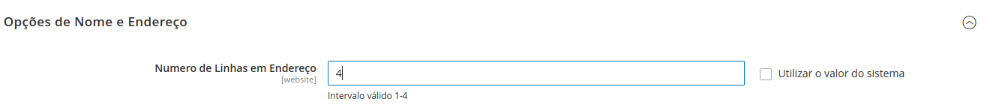
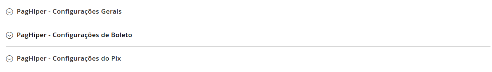
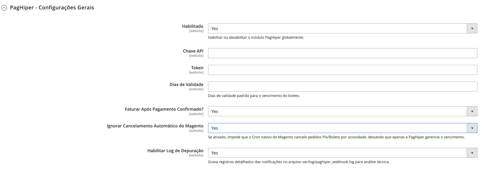
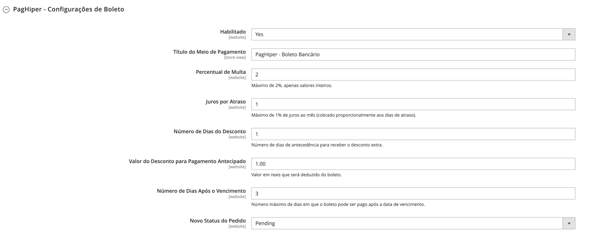
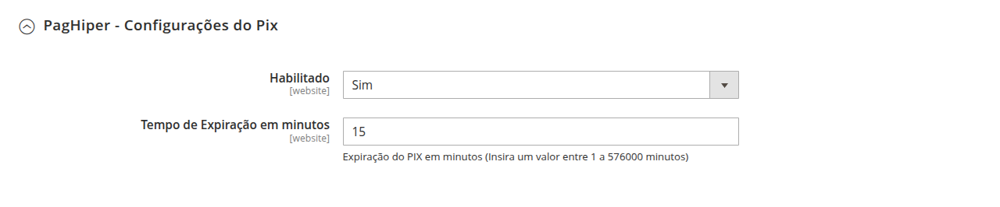

# Módulo de Integração [PagHiper](https://www.paghiper.com/)

## Instalação

> ⚠️ Recomendamos fortemente o uso de um ambiente de testes para validar alterações e atualizações antes de aplicá-las na sua loja em produção. Além disso, realize sempre um backup completo com todas as informações antes de executar qualquer procedimento de atualização ou instalação.

### Versões Compatíveis

- [x] 2.3.X
- [x] 2.4.0
- [x] 2.4.1
- [x] 2.4.2
- [x] 2.4.3
- [x] 2.4.4
- [x] 2.4.5
- [x] 2.4.6
- [x] 2.4.8
- [x] 2.4.9

### Requisitos:

- PHP na versão mínima 7.3.X.  
- O endereço do cliente deve conter pelo menos 3 linhas.

###  Instalação do Módulo PagHiper

- Faça o download do módulo e siga os passos conforme o modo de instalação da sua loja:

  #### [Paghiper Module](https://github.com/paghiper/Modulo-PagHiper-Pix-Magento-2.3.X-e-2.4.X)

### Instalação via Composer

1. Instale pelo Packagist executando: 
  - ```composer require paghiper/module-magento2```
    - Se solicitado, informe suas credenciais de autenticação do Magento. [Adobe Documentation](http://devdocs.magento.com/guides/v2.0/install-gde/prereq/connect-auth.html).
2. Execute os comandos abaixo para concluir a instalação:
  - ```bin/magento setup:upgrade```
  - ```bin/magento setup:di:compile```
  - ```bin/magento setup:static-content:deploy -f```


### Instalação via GitHub (Clone ou Download do Projeto Magento)

Se sua loja foi criada clonando ou baixando o projeto Magento, siga estas etapas:

1. Baixe o repositório como arquivo .zip
2. Dentro do diretório de instalação da sua loja, crie a pasta com seguinte estrutura: app/code/Paghiper/Magento2
3. Extraia o conteúdo do arquivo .zip nessa pasta
4. Execute para habilitar o módulo: bin/magento module:enable Paghiper_Magento2 --clear-static-content.
5. Execute o comando bin/magento setup:upgrade.
6. Execute o comando bin/magento setup:di:compile.
7. Execute o comando bin/magento setup:static-content:deploy -f.
8. Execute o comando bin/magento cache:clean.

### Configurações

Configurar Endereço no Painel Administrativo do Magento
É importante ajustar a quantidade de linhas permitidas no endereço do cliente para que a integração funcione corretamente.
Para isso seguimos os seguintes passos:

1. No painel administrativo do Magento, clique em `Stores`
2. Agora vamos em `Configuration`.
3. Proximo passo é clicar em `Customers`, depois `Customer Configuration`.
4. Acesse a opção `Name and Address Options`.
5. Em `Number of Lines in Address`, configure para 4
6. Agora basta salvar as alterações
   
Essa configuração ajusta quantas linhas são usadas no formato de endereço, permitindo que você inclua os campos obrigatórios para os endereços de seus clientes



Configurar Métodos de Pagamento no Magento
Após configurar os dados do cliente, siga para a configuração dos métodos de pagamento:

1. No painel administrativo, vá em `Stores`
2. Clique em `Configuration`.
3. No submenu vamos em `Sales`, e clicamos em `Payment Methods`.

Isso carregará a tela onde você poderá configurar os métodos de pagamento para o seu site.



### Como habilitar o PagHiper na sua loja

No primeiro bloco de informações dentro da seção PagHiper, você encontrará a opção para ativar ou desativar o módulo:

- **Habilitado**
  - Ativa ou desativa o modulo da PagHiper.
  
- **Chave API**
  - Insira sua apiKey fornecida pela PagHiper.

- **Token**
  - Token insira seu token gerado na PagHiper

- **Dias de validade**
  - Esta opção é utilizada tanto para boleto quanto para Pix. Um valor inteiro em `dias` é usado para especificar o período de validade do pagamento.

- **Faturar Após Pagamento Confirmado?**
  - Ative para que a nota fiscal seja gerada somente após a confirmação do pagamento.

- **Ignorar Cancelamento Automático do Magento**
  - Ative para que as rotinas automaticas de cancelamento de pedidos, não afete os pedidos emitidos atráves da PagHiper

- **Habilitar Log de Depuração**
  - Ao ser ativado começa a salvar em arquivo local os logs das comunicações da PagHiper para seu ambiente



Logo abaixo, você encontrará duas opções: uma para configuração de pagamento com Pix e outra com boleto.

NOTA: Para que todas as configurações a seguir funcionem, todas as etapas anteriores devem ter sido seguidas.

### Configurações do Boleto

- **Habilitado**
  - Ativa ou desativa o boleto como método de pagamento.

- **Titulo do Meio de Pagamento**
  - Nome do meio de pagamento que aparece ao cliente.

- **Percentual de Multa**
  - Adiciona um valor percentual da multa (0,1,2).

- **Juros por Atraso**
  - Determina se serão aplicados juros por atraso no pagamento e o valor.

- **Número de Dias do Desconto**
  - O número de dias antes do qual um desconto é concedido sobre o valor informado.

- **Valor do Desconto por Pagamento Antecipado**
  - O valor do desconto que será concedido ao boleto.

- **Número de Dias Após o Vencimento**
  - O número de dias que o cliente ainda pode pagar o boleto após a data de vencimento.
  


### Configurações do Pix

- **Habilitado**
  - Ativa ou desativa o método de pagamento Pix.

- **Titulo do Meio de Pagamento**
  - Nome do meio de pagamento que aparece ao cliente.

- **Tempo de Expiração em minutos**
  - Tempo de expiração do pagamento Pix em minutos. Se não for fornecido, o valor do campo `Dias de Validade` será usado.


